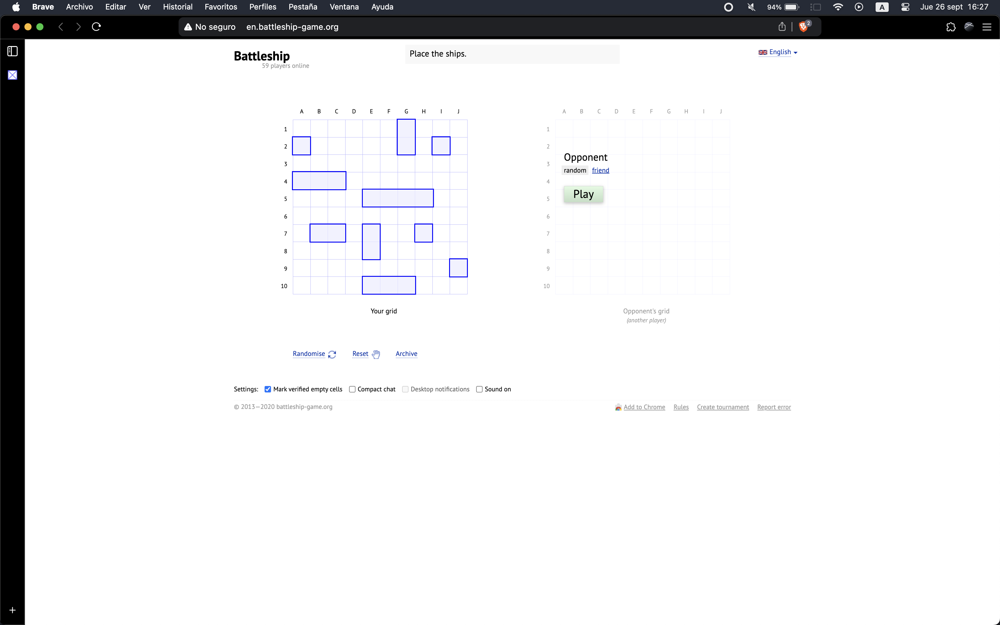
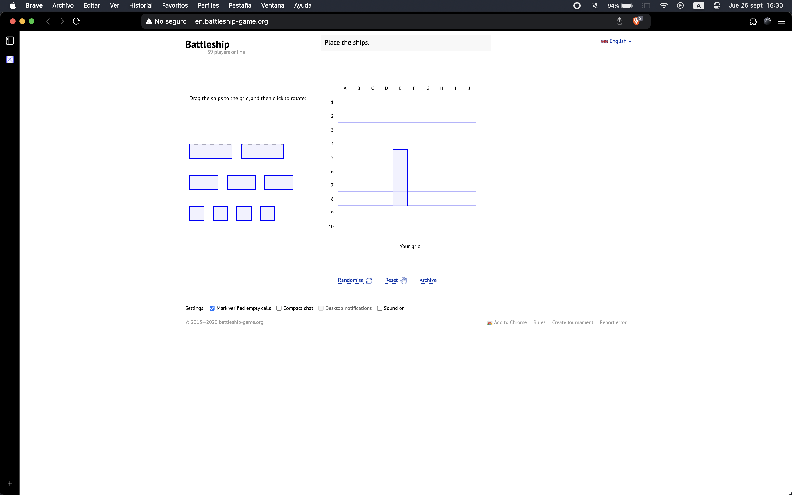
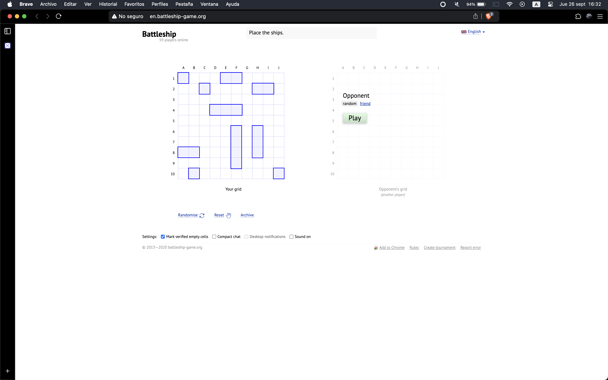
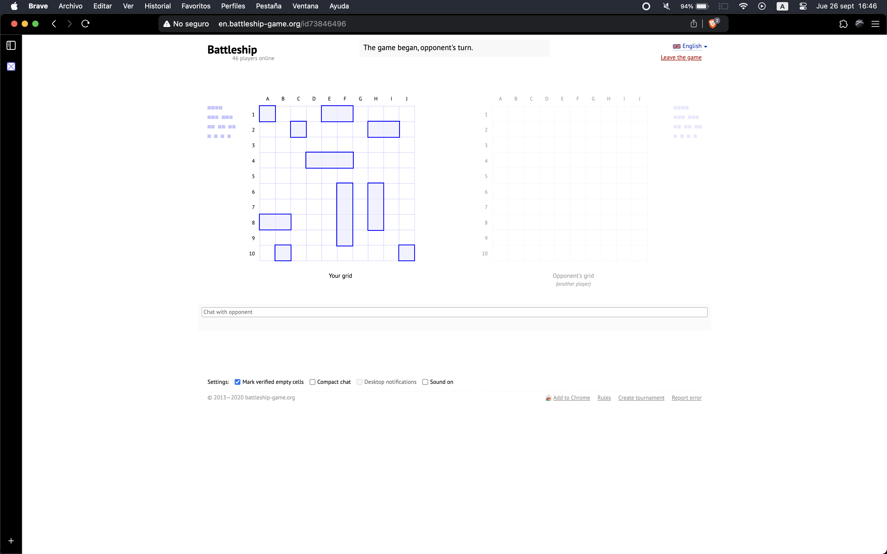
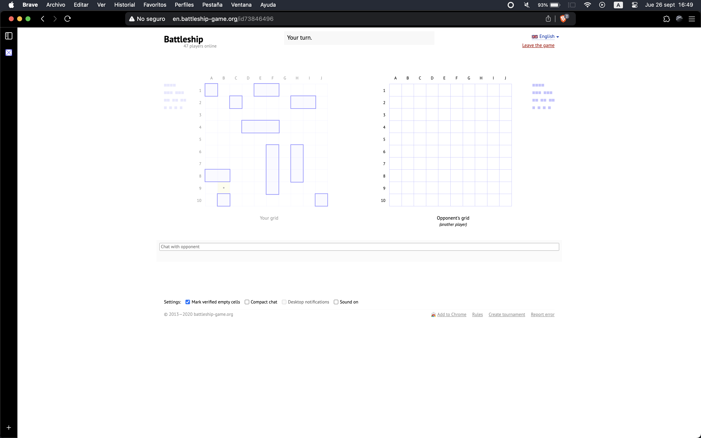
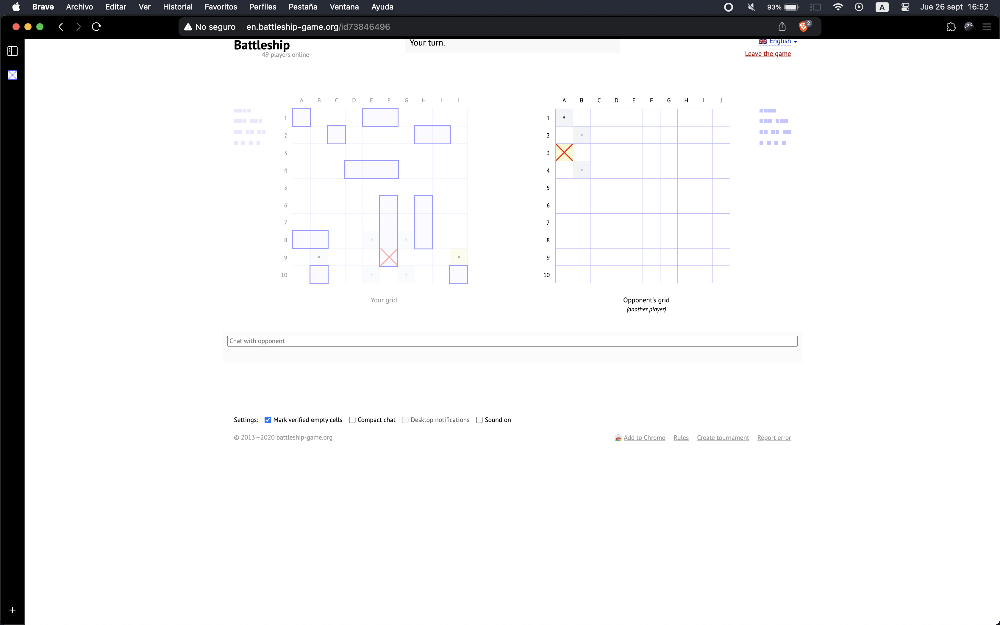
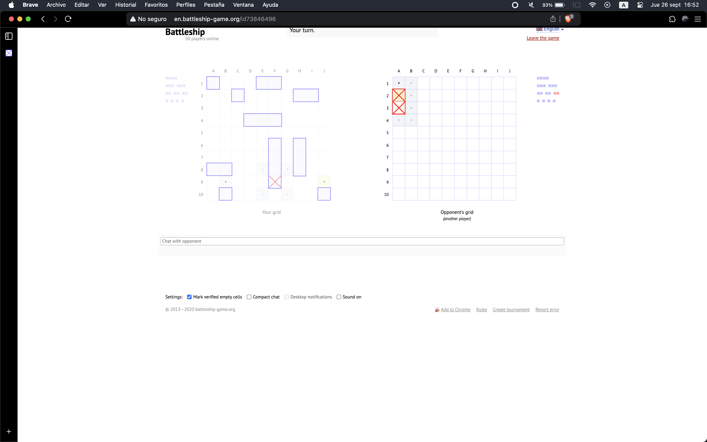
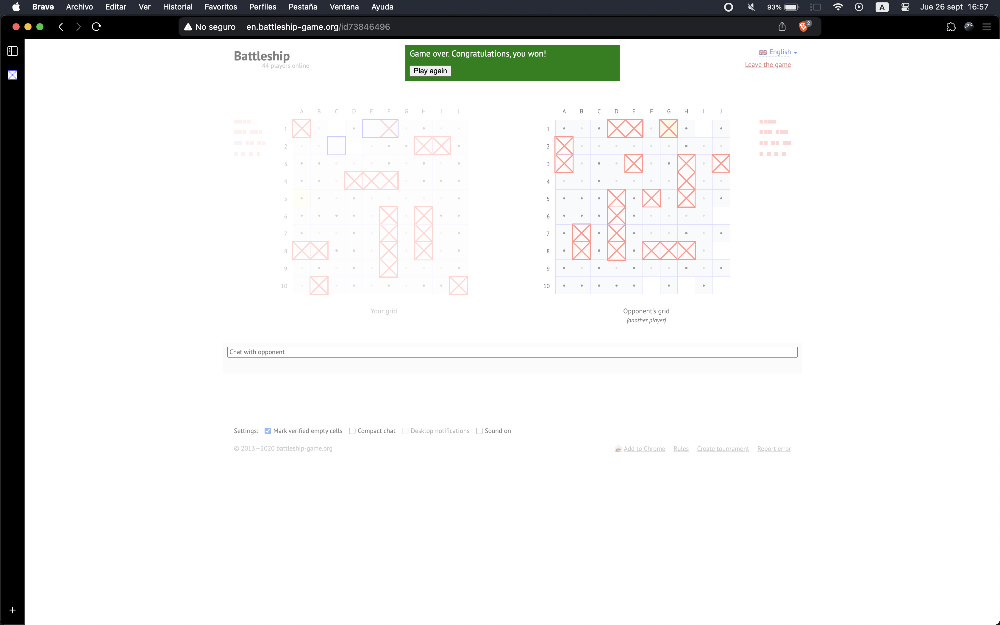

# Objetivos

## Objetivo General

 Automatizar y optimizar la experiencia de juego en el sitio web Battleship Game mediante un sistema que posicione estratégicamente las piezas y tome decisiones de juego basadas en probabilidades, permitiendo al usuario disfrutar del juego sin intervención manual constante.

## Objetivos Específicos

<ul>
  <li>
     
 
	Facilitar la colocación óptima de los barcos mediante un algoritmo que utilice datos de victorias anteriores para posicionar las piezas de manera estratégica.
	

  </li>
  <li>
    

      Maximizar las probabilidades de éxito implementando un sistema que seleccione las casillas con mayor probabilidad de acertar durante el juego, basándose en patrones de juego anteriores.
    

  </li>
    <li>
    

    Minimizar la intervención del usuario durante el proceso de posicionamiento de piezas y toma de decisiones, proporcionando una experiencia automatizada e intuitiva.
    

  </li>
    <li>
    

      Aumentar la tasa de victorias del usuario utilizando un sistema inteligente que optimice tanto la colocación inicial de las piezas como la toma de decisiones en cada turno.
    

</ul>

## Solución del proyecto

Este proyecto utiliza las tecnologías Tau Prolog y RoboJS para automatizar el juego de Battleship en el sitio Battleship Online. A continuación, se describe cada paso del proceso:

### 1. Abrir el navegador

]

### Descripción

Se ejecuta un comando que abre el navegador Brave, accediendo automáticamente al sitio web del juego de Battleship.

## 2. Dirigirse a la página de Battleship

### Descripción

El script navega hacia la URL "http://en.battleship-game.org/" donde se llevará a cabo la partida automatizada.

## 3. Resetear el tablero

### Descripción

Se selecciona la opción Reset para comenzar el juego con un tablero limpio y listo para la colocación de los barcos.

## 4. Colocación de los barcos

### Descripción

El algoritmo consulta un conjunto de datos históricos que contiene los posicionamientos de barcos con mayor porcentaje de victorias. Se eligen entre las tres posiciones más favorables para colocar cada barco en el tablero.

### 4.1 Decisión de las celdas

### Descripción

Tau Prolog se encarga de enviar las mejores posiciones para los barcos, considerando su orientación y ubicación estratégica. RoboJS ejecuta estas decisiones de forma automática en el navegador.

## 5. Inicio de la partida

### Descripción

Tras colocar todas las piezas, el juego se inicia. Buscando partida contra una persona real.

### 5.1 Decisión del turno de jugador

### Descripción

Una vez iniciada la partida, se empieza verificando el turno actual, si es momento de "Atacar" o "Esperar".

### Descripción

La forma para detectar el estado es con un mensaje que aparece de la propia página, indicando si es turno del oponente o nuestro.

### Descripción

Empieza nuestro turno para poder disparar a las celdas.

### 5.2 Algoritmo para disparos a celdas

### Descripción

Durante cada turno, el algoritmo analiza las casillas disponibles y selecciona aquellas con mayor probabilidad de acierto, basándose en patrones de juego anteriores y las reglas de búsqueda programadas en Tau Prolog.

### 5.3 Primer impacto

### Descripción

Si el algoritmo detecta que ha impactado en un barco enemigo, ajusta las decisiones para atacar las casillas adyacentes y, eventualmente, hundir el barco.

### Descripción

Cada vez que se acierta un objetivo, el sistema toma decisiones estratégicas sobre dónde atacar después, utilizando patrones predefinidos para maximizar los aciertos.

### 5.4 Continuación del flujo

### Descripción

Todas estas decisiones se mantienen hasta que finalice la partida. Existen diferentes formas en que puede finalizar una partida.

### 5.5 Mensajes

### Descripción

Para identificar si se ha ganado el juego, se observa si aparece un mensaje con un fondo de color verde, indicando que se ha finalizado el juego satisfactoriamente.

### Descripción

Si el color del fondo es rojo, nos indica que se ha finalizado el juego y perdido este mismo.

### Descripción

Existe un caso dónde el jugador rival puede abandonar la partida, con ello sabemos que ya debe finalizar la partida.

## Conclusiones

<ul>
  <li>
     
 
	Automatización Exitosa: Se logró automatizar con éxito el proceso de posicionamiento y toma de decisiones en el juego Battleship Game, permitiendo al usuario disfrutar del juego sin intervención manual constante, cumpliendo con el objetivo general del proyecto.
	

  </li>
  <li>
    

      Optimización Estratégica: El algoritmo implementado para la colocación de las piezas demostró ser eficaz al utilizar datos previos de victorias, lo que mejoró significativamente la estrategia inicial y la tasa de victorias del jugador.
    

  </li>
    <li>
    

    Reducción de la Intervención del Usuario: A través de la integración de Tau Prolog para la toma de decisiones y RoboJS para ejecutar las acciones, se redujo considerablemente la participación del usuario durante el juego, logrando una experiencia más fluida y automatizada.
    

  </li>
    <li>
    

      Toma de Decisiones Basada en Probabilidades: El sistema de selección de casillas con mayor probabilidad de acierto permitió optimizar los disparos durante el juego, aumentando la efectividad de los movimientos y mejorando los resultados del jugador.
    

    </li>
    <li>
    

     Mejora en la Tasa de Victorias: Gracias a la implementación de algoritmos de posicionamiento y selección de movimientos basados en patrones y probabilidades, se observó un incremento en la tasa de victorias, cumpliendo así con uno de los principales objetivos del proyecto.
    

</ul>

## Opiniones

<ul>
  <li>
     
 
	Tau Prolog como Motor de Toma de Decisiones:
	Tau Prolog demostró ser una herramienta robusta para el manejo de lógica y reglas en la toma de decisiones dentro del juego. Su capacidad para gestionar consultas lógicas complejas y evaluar posibles movimientos del jugador en base a probabilidades lo convierte en una opción adecuada para implementar sistemas inteligentes en juegos de estrategia. Sin embargo, su integración con otros lenguajes y tecnologías puede ser algo desafiante para desarrolladores menos familiarizados con la programación lógica.
	

  </li>
  <li>
    

    RoboJS para la Automatización de Acciones:
	El uso de RoboJS para la automatización de acciones resultó en una experiencia de usuario fluida y con pocas interrupciones. La capacidad de interactuar con la interfaz del navegador y realizar movimientos automáticamente permitió un control eficiente del juego. No obstante, uno de los retos fue garantizar la sincronización precisa entre los comandos generados por Tau Prolog y su ejecución en el navegador, lo que requiere ajustes.
    

  </li>
    <li>
    

    Integración de Navegador y Algoritmos:
	Utilizar un navegador web como plataforma de ejecución para el proyecto mostró el potencial de combinar tecnologías modernas como Brave Browser o Google Chrome con herramientas de automatización como RoboJS y Tau Prolog. La flexibilidad del entorno de desarrollo permite crear soluciones prácticas para juegos en línea. Sin embargo, la dependencia en navegadores específicos puede limitar la portabilidad del sistema si el sitio web cambia su estructura.
    

  </li>
    <li>
    

    Desarrollo en un Entorno MacOS:
	Trabajar en MacOS proporcionó una experiencia estable y eficiente para el desarrollo de este tipo de proyecto. Las herramientas de automatización y programación lógica se integraron bien en este sistema operativo, ofreciendo buenas opciones de manejo de scripts y automatización de tareas. Sin embargo, la compatibilidad con otros sistemas operativos podría necesitar ajustes adicionales para garantizar un rendimiento óptimo en entornos diferentes.
    

    </li>
    <li>
    

    Perspectiva General sobre Automatización en Juegos:
	El proyecto demuestra cómo la combinación de diferentes herramientas puede optimizar la experiencia en juegos online mediante automatización y algoritmos inteligentes. El enfoque utilizado puede servir como base para otros desarrollos similares, no solo en juegos, sino también en cualquier sistema que requiera decisiones automatizadas basadas en datos. A futuro, se podrían explorar más tecnologías de inteligencia artificial para mejorar aún más las decisiones y adaptabilidad del sistema.
    

</ul>
